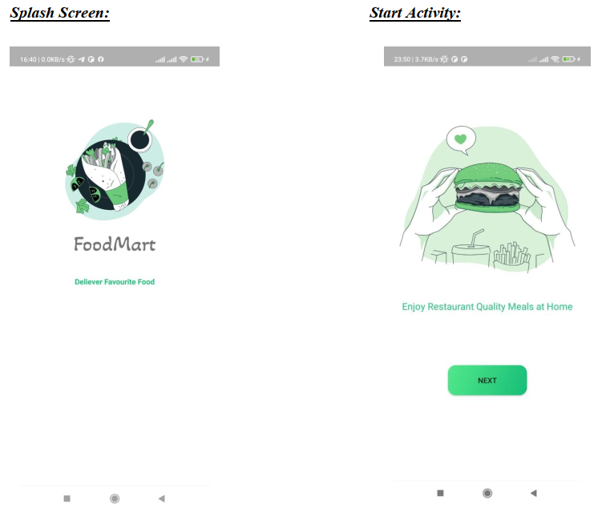
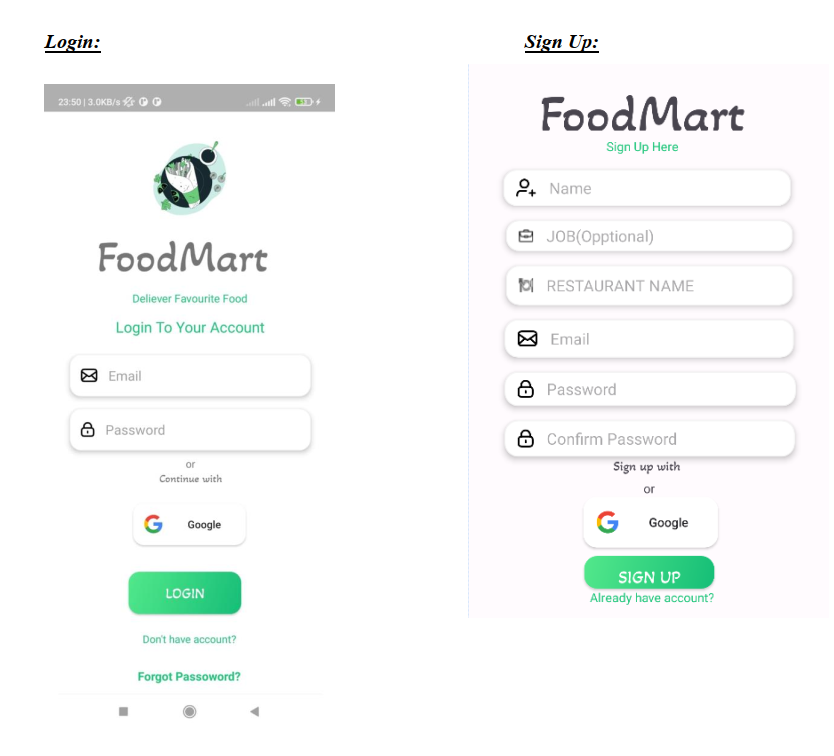
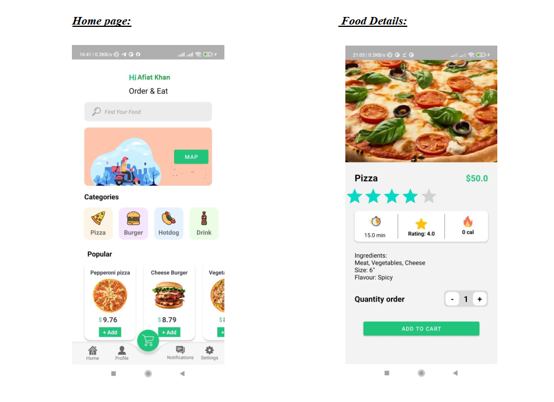
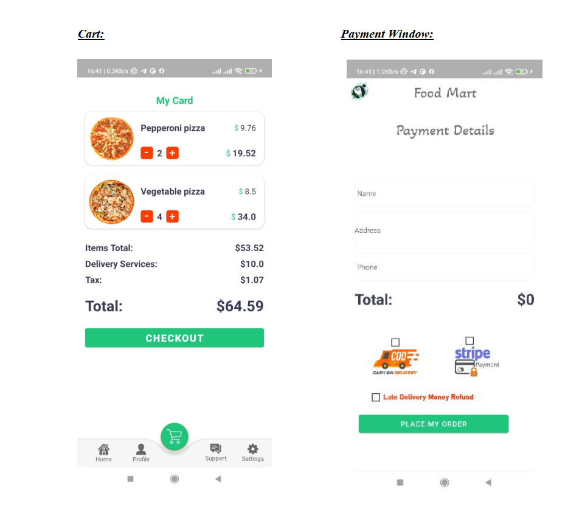
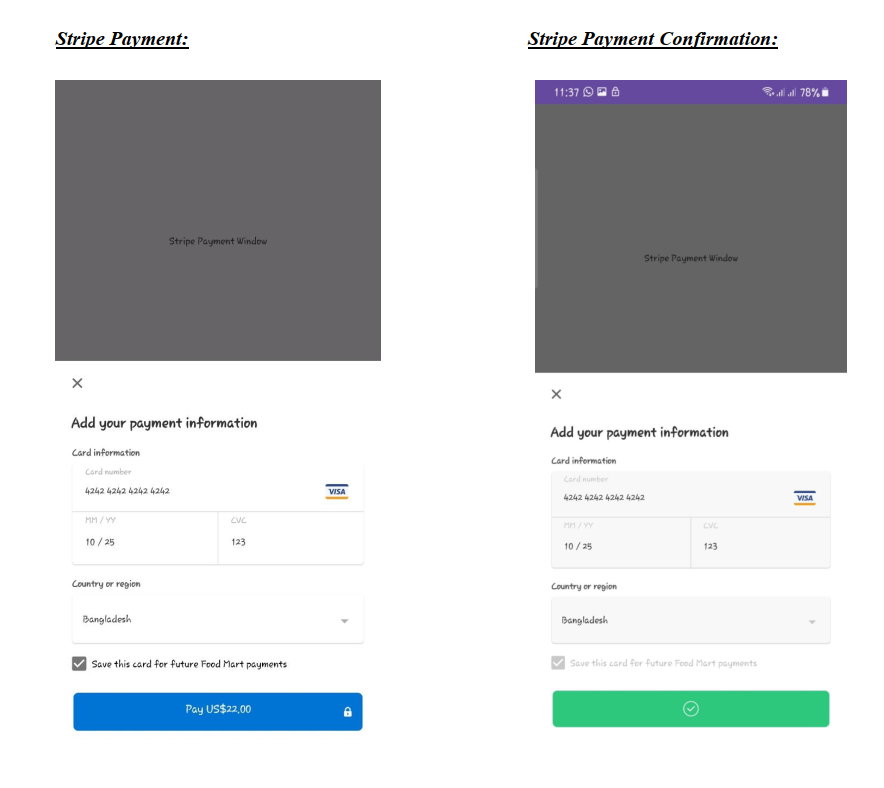
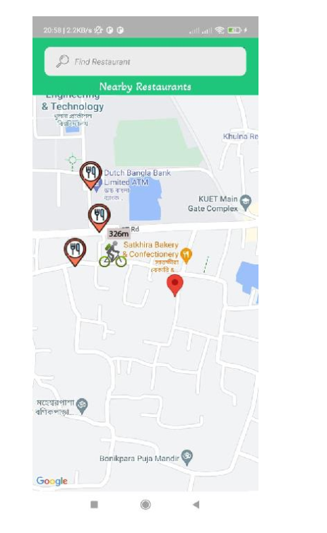
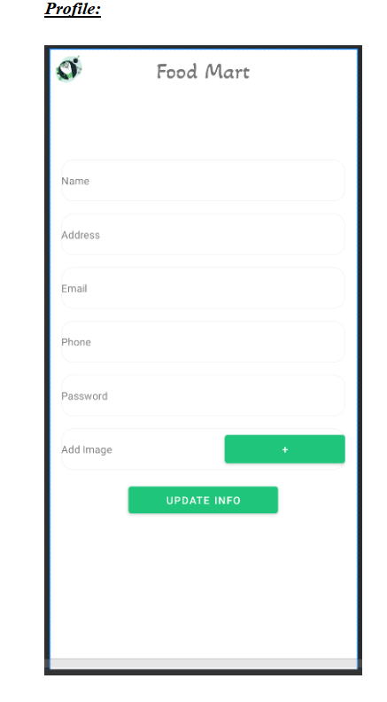
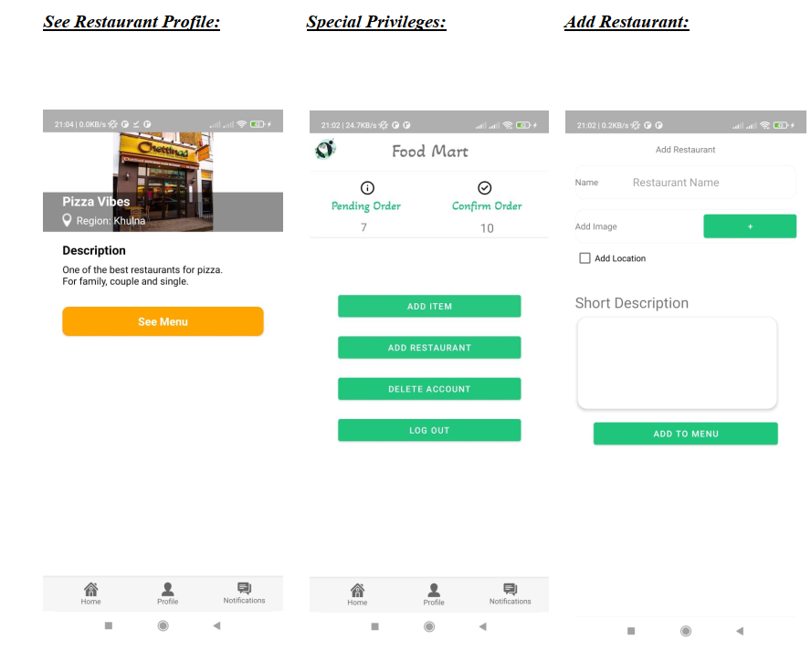
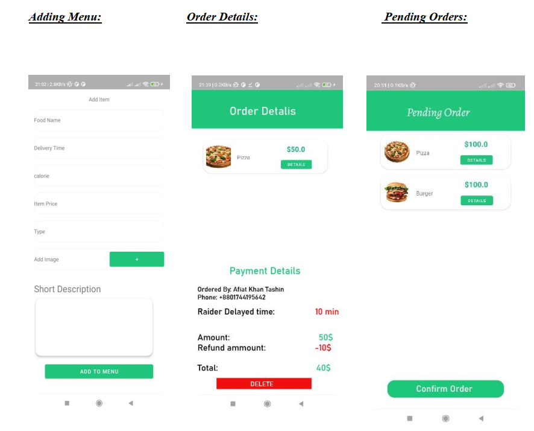
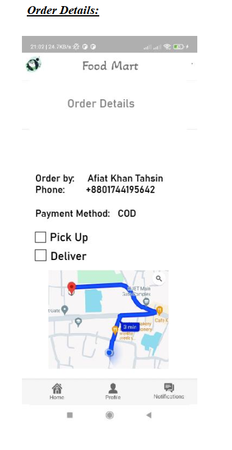

# FoodMart – Android Food Delivery App

**FoodMart** is a user-friendly online food delivery system built for Android devices. Designed to enhance the customer experience, it features real-time delivery tracking via Google Maps, secure authentication, and payment processing using Stripe. The app addresses common food delivery issues like delays and miscommunication through robust role-based access and an intuitive interface.

---

## Features

### User Roles
- **Admin** – Manage multiple restaurants and menus.
- **Manager** – Handle restaurant orders, menu items, and kitchen workflow.
- **Rider** – Deliver orders and update live location via Google Maps.
- **Customer** – Browse food items, place orders, and track deliveries.

### Core Functionality
- Real-Time Tracking – Google Maps integration for order delivery tracking and restaurant locations.
- Secure Authentication – Login via Firebase or Google Sign-In.
- Payment Options – Cash on Delivery and online payment through Stripe (simulated).
- Penalty System – Customers can apply penalties for late deliveries.
- Dynamic Cart System – Add/remove items, update quantities, and proceed to smooth checkout.

---

## UI Design

### Splash Screen


### Start Activity


### Login


### Sign Up


### Home Page


### Food Details


### Cart


### Payment Window


### Stripe Payment


### Stripe Payment Confirmation


### Nearby Restaurants with Live Rider Location


### Update Profile


### See Restaurant Profile


### Add Restaurant


### Special Privileges (Admin Dashboard)


### Pending Orders


### Order Details


### Adding Menu


### Delivery Order with Map Tracking


---

## App Flow Chart

The following flow chart demonstrates the process flow of the FoodMart application:


---

## System Design & Development Model

FoodMart follows the Waterfall Development Model:

1. **Requirements Gathering** – Research and analysis of market-leading food delivery apps.
2. **Design** – UI mockups, wireframes, and database architecture.
3. **Development** – Full-stack implementation using Java and Firebase in Android Studio.
4. **Testing** – Rigorous testing across Android devices to ensure performance and reliability.
5. **Deployment** – Final release of the stable APK.
6. **Maintenance** – Continuous updates, bug fixes, and user feedback integration.

---

## Tech Stack & Tools

| Component             | Technology                        |
|----------------------|------------------------------------|
| Frontend             | Java (Android Studio)              |
| Authentication       | Firebase Authentication, Google Sign-In |
| Database             | Firebase Realtime Database         |
| Tracking             | Google Maps API                    |
| Payments             | Stripe API (simulated)             |
| Version Control      | GitHub                             |

---

## Installation & Setup

Follow these steps to set up and run the FoodMart app locally:

1. **Clone the repository**
   ```bash
   git clone https://github.com/your-username/FoodMart.git
2. **Open in Android Studio.**

3. **Configure Firebase:**

     - Add google-services.json to your app/ directory.

     - Enable Email/Password and Google Authentication in Firebase Console.

4. **Set up Google Maps:**

     - Get an API key from Google Cloud Console.

     - Add the API key to AndroidManifest.xml.

5. **Run the app on your emulator or Android device.**


